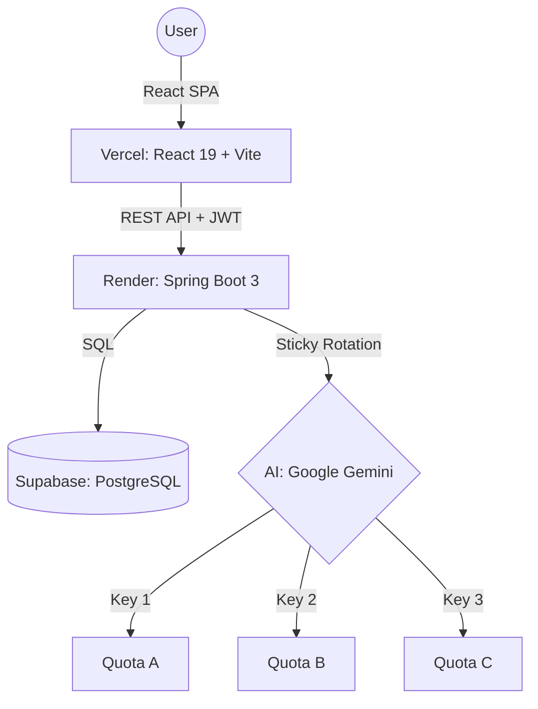

# 🚀 PrepMate: GenAI-Powered Career Accelerator

PrepMate is a **Generative AI** platform designed to bridge the gap between learning and employment. It utilizes **LLMs (Large Language Models)** to provide custom roadmaps and realistic technical interview simulations.

### 🔗 [Live Demo (GenAI-Powered): prepmate-snowy.vercel.app](https://prepmate-snowy.vercel.app/)

---


## 🏗️ System Architecture (LLM Stack)



---

## ✨ Core Features

### 🎯 Intelligent Roadmap Generation
Enter your career goal (e.g., "Full Stack Developer in 3 months"), and PrepMate generates a structured, week-by-week learning path using Gemini  Flash.

### 🎙️ AI Technical Interviews
Simulate real interviews for any tech stack (Java, Python, React, etc.). The AI asks deep technical questions, evaluates your spoken/written answers, and provides a "Score" with improvement tips.

### � Sticky Key Rotation (Proprietary Logic)
To bypass the strict free-tier rate limits of AI providers, PrepMate implements a **Sticky Key Rotation** algorithm:
- Tracks exhaustion status for up to 3 API keys.
- Automatically fails over to the next available key on `429 (Too Many Requests)` errors.
- "Sticky" behavior: stays on a working key until it hits a limit, maximizing efficiency.

### 🔐 Secure-by-Design
- **JWT Authentication**: Stateless security with HttpOnly-compatible headers.
- **CORS Protection**: Strict origin-server mapping for production.

---

## 🌐 Production Deployment Summary

### Environment Configuration (Render/Railway)
| Key | Logic |
|:--- |:--- |
| `SPRING_DATASOURCE_URL` | Use **Supabase Session Pooler** URL (Port 5432) for IPv4 compatibility. |
| `JAVA_OPTS` | Must include `-Djava.net.preferIPv4Stack=true` for Render/Supabase bridge. |
| `JWT_SECRET` | Required 32+ character string for HMAC-SHA256 signature. |

---

## 📬 Detailed API Reference

### Authentication
`POST /api/auth/register`
```json
{
  "email": "user@example.com",
  "password": "securePassword123",
  "name": "Jane Doe"
}
```

`POST /api/auth/login`
```json
// Returns:
{
  "token": "eyJhbGciOiJIUzI1Ni...",
  "status": "success"
}
```

### AI roadmap
`POST /api/roadmap/generate` (Requires JWT)
- **Input**: `{ "goal": "DevOps Engineer" }`
- **Output**: Detailed JSON roadmap object.

---

## �️ Troubleshooting (Common Deploys)

| Issue | Resolution |
|:--- |:--- |
| **Status 1 / Dialect Error** | Ensure `SPRING_DATASOURCE_URL` starts with `jdbc:postgresql://` and ends with `?sslmode=require`. |
| **Network Unreachable** | Add `-Djava.net.preferIPv4Stack=true` to `JAVA_OPTS`. |
| **Port Scan Timeout** | Add `SPRING_MAIN_LAZY_INITIALIZATION=true` to speed up Spring Boot startup. |
| **JWT Weak Key** | Increase `JWT_SECRET` to at least 32 characters. |

---

## 🤝 Contributing
1. Fork the repo.
2. Create your branch (`git checkout -b feature/AmazingFeature`).
3. Commit changes (`git commit -m 'Add AmazingFeature'`).
4. Push to branch (`git push origin feature/AmazingFeature`).
5. Open a Pull Request.

---

## 🛡️ License
Copyright © 2026 Mahadev J. Distributed under the MIT License.
