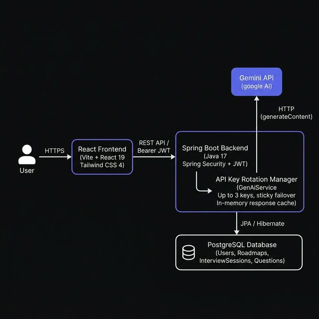

# PrepMate

PrepMate is a full-stack web app for people preparing for technical job interviews. Users register, generate AI-written learning roadmaps for a stated career goal, run practice or mock interview sessions with Gemini-generated questions, submit answers for scored feedback, and review past sessions. The React frontend talks to a Spring Boot API; PostgreSQL stores users, roadmaps, sessions, and questions.

Live frontend: [prepmate-snowy.vercel.app](https://prepmate-snowy.vercel.app/)
This project is hosted on free-tier services (Render/Supabase).
The first request may take 30–60 seconds if services are waking from inactivity.


## Architecture



The diagram shows the complete request flow:

- The **React frontend** (Vite + React 19, Tailwind CSS 4) communicates with the backend over HTTPS using JWT Bearer tokens.
- The **Spring Boot backend** (Java 17) handles auth, roadmap generation, and interview session management. Spring Security validates JWTs on every protected request.
- **GenAiService** (the API Key Rotation Manager) wraps all Gemini calls. It holds up to three API keys and switches to the next key only on quota-class errors, keeping the current good key sticky. Successful responses are stored in an in-memory `ResponseCache` (60-minute TTL, 500-entry cap) to avoid duplicate Gemini calls.
- **Gemini API** is called directly over HTTP using `java.net.http.HttpClient` — no SDK dependency.
- **PostgreSQL** stores users, roadmaps, interview sessions, and questions via Spring Data JPA.

## Tech stack

**Backend** (`prepmate-backend/`, Java 17)

- Spring Boot 3.3.5 (`spring-boot-starter-web`, `spring-boot-starter-data-jpa`, `spring-boot-starter-security`, `spring-boot-starter-validation`)
- PostgreSQL driver, H2 (runtime scope in `pom.xml`, not used when PostgreSQL URL is set)
- JJWT 0.11.5 for JWT signing
- Lombok
- Google Gemini HTTP API via `java.net.http.HttpClient` (no official Gemini SDK)

**Frontend** (`prepmate-frontend/`)

- React 19.2, React Router 7.15
- Vite 8, `@vitejs/plugin-react` 6
- Tailwind CSS 4 (`@tailwindcss/vite`)
- lucide-react, clsx, tailwind-merge

**Deployment pieces in repo**

- Backend `Dockerfile` (multi-stage Maven build + JRE 17)
- Frontend `.env.example` with `VITE_API_BASE_URL`

There is no `docker-compose` file in this repository.

## How the API key rotation works

All Gemini calls go through `GenAiService.ask(String prompt)`.

**Key loading.** At startup the service reads up to three keys from `gemini.api.key`, `gemini.api.key2`, and `gemini.api.key3` (overridable via `GEMINI_API_KEY`, `GEMINI_API_KEY2`, `GEMINI_API_KEY3`). Keys that are blank or contain the placeholder `YOUR_GEMINI` are skipped. The active model defaults to `gemini-2.5-flash` (`gemini.model` / `GEMINI_MODEL`).

**Cache before network.** Before any HTTP call, the prompt is looked up in `ResponseCache`, an in-memory map keyed by `prompt.hashCode()` with a 60-minute TTL and a 500-entry cap. A hit returns the cached text and skips Gemini entirely.

**Per-key retries.** For each key attempt, `callGeminiWithRetries` runs up to two attempts. HTTP 429 and 503 responses are treated as retryable: the client parses a retry delay from the JSON error body (or defaults to 5 seconds), waits up to 10 seconds, and retries on the same key. Non-retryable errors (e.g. 400) return immediately with an `AI_ERROR:` prefix and do not rotate keys.

**Sticky rotation across keys.** `currentKeyIndex` points at the last known-good key. On each `ask` call the service loops at most `apiKeys.size()` times. Each iteration uses `keyIndex = currentKeyIndex % apiKeys.size()` under a lock, calls Gemini with that key, and on success caches and returns the response.

If the result starts with `AI_ERROR:` and the message looks like quota exhaustion (`quota`, `rate limit`, `resource_exhausted`, or `429` in the text), the service increments `currentKeyIndex` only when the failing key is still the active one, logs to stderr, and continues the loop to try the next key. Non-quota errors stop the loop and return the error string.

If every key fails or is exhausted, `ask` returns `AI_ERROR: All API keys exhausted or failing: …` with the last error message.

**What rotation does not do.** There is no persistence of key state across restarts, no per-key quota accounting beyond the in-process index, and no alerting when all keys are exhausted—only stderr logs and the error string returned to the caller.

## Setup

### Prerequisites

Java 17, Maven 3.9+, Node.js, PostgreSQL, and at least one Gemini API key.

### Database

Create a PostgreSQL database (default name in config: `prepmate`).

### Backend (local)

```bash
cd prepmate-backend
cp src/main/resources/application.properties.example src/main/resources/application.properties
```

Set values in `application.properties` or export environment variables:

| Property / env | Purpose |
|---|---|
| `SPRING_DATASOURCE_URL` | JDBC URL, e.g. `jdbc:postgresql://localhost:5432/prepmate` |
| `SPRING_DATASOURCE_USERNAME` / `SPRING_DATASOURCE_PASSWORD` | DB credentials |
| `GEMINI_API_KEY` (+ optional `_KEY2`, `_KEY3`) | Gemini keys |
| `JWT_SECRET` | HMAC secret for JWTs |
| `ALLOWED_ORIGINS` | Comma-separated CORS origins (default includes `http://localhost:5173`) |
| `PORT` | Server port (default `8080`) |

```bash
mvn spring-boot:run
```

On first boot, `PrepMateApplication` seeds an admin user `mahadev@prepmate.com` if missing (see Known limitations).

### Backend (Docker)

From `prepmate-backend/`, using the existing `Dockerfile` verbatim:

```bash
docker build -t prepmate-backend .
docker run -p 8080:8080 \
  -e SPRING_DATASOURCE_URL=jdbc:postgresql://host.docker.internal:5432/prepmate \
  -e SPRING_DATASOURCE_USERNAME=postgres \
  -e SPRING_DATASOURCE_PASSWORD=yourpassword \
  -e GEMINI_API_KEY=your_key \
  -e JWT_SECRET=your_long_secret \
  -e ALLOWED_ORIGINS=http://localhost:5173 \
  prepmate-backend
```

The image copies `application.properties.example` to `application.properties` at build time; runtime secrets are expected via environment variable substitution in that file.

### Frontend

```bash
cd prepmate-frontend
cp .env.example .env
npm install
npm run dev
```

Default API base URL in `.env.example` is `http://localhost:8080`. The landing page calls `GET /api/test/ping` on load to wake a cold backend.

## Architecture decisions

**Multiple Gemini keys with sticky failover instead of a single key and long backoff.** Free-tier quotas are per API key. The service keeps using the current key until a quota-class error forces `currentKeyIndex` forward, which avoids unnecessary key switches on transient 429s that resolve within the two per-key retries.

**In-memory prompt cache.** `ResponseCache` stores successful Gemini responses keyed by prompt hash to cut duplicate calls for identical prompts (roadmap generation and evaluation prompts that repeat). Tradeoff: cache is per JVM instance and disappears on restart.

**Stateless JWT with role resolved from the database.** `JwtUtil` signs a 24-hour token with the user email as subject only. `JwtAuthenticationFilter` loads the current `role` from `UserRepository` on each authenticated request and sets `ROLE_*` authorities. Admin routes (`/api/admin/**`) require `ROLE_ADMIN`. This keeps tokens small but means role changes take effect without re-login.

**Direct HTTP to Gemini rather than an SDK.** `GenAiService` builds the `generateContent` JSON body and parses candidates manually. That keeps dependencies minimal and makes 429/503 retry handling explicit in one class.

## API overview

| Area | Endpoints |
|---|---|
| Auth | `POST /api/auth/register`, `POST /api/auth/login`, `POST /api/auth/change-password` (authenticated) |
| Roadmap | `POST /api/roadmap/generate`, `GET /api/roadmap/history/{userId}` |
| Interview | `POST /api/interview/generate`, `POST /api/interview/evaluate`, `GET /api/interview/history/{userId}`, `GET /api/interview/session/{sessionId}` |
| Admin | `GET /api/admin/metrics`, `GET /api/admin/users`, `GET /api/admin/insights`, `POST /api/admin/reset-password` |
| Health | `GET /api/test/ping`, `GET /api/test/ai?prompt=...` (unauthenticated) |

Protected routes expect `Authorization: Bearer <token>`.

## Known limitations

**No automated tests.** The backend has no test classes under `src/test`. Behavior is unverified by CI.

**No observability on rotation or cache.** Key switches and cache hits are `System.out` / `System.err` only. There are no metrics, structured logs, or alerts when all keys are exhausted.

**Authorization gaps on user-scoped resources.** Interview and roadmap endpoints accept a `userId` in the request body or path but do not verify it matches the authenticated JWT user. Any logged-in user can pass another user's ID.

**Public test endpoints.** `/api/test/ping` and `/api/test/ai` are permit-all in `SecurityConfig`. The AI test route can consume Gemini quota without authentication.

**Hardcoded admin bootstrap credentials.** `PrepMateApplication` creates or upgrades `mahadev@prepmate.com` with password `mahadev123` (BCrypt-hashed at runtime). This is unsuitable for any shared or production deployment without removal or change.

**Response cache keying.** Cache keys use `String.hashCode()`, which can collide for different prompts and is not stable across JVM instances.

**Docker scope.** Only the backend is containerized. The frontend and database are not defined in a compose file in this repo.

## License

MIT. Copyright 2026 Mahadev J.
